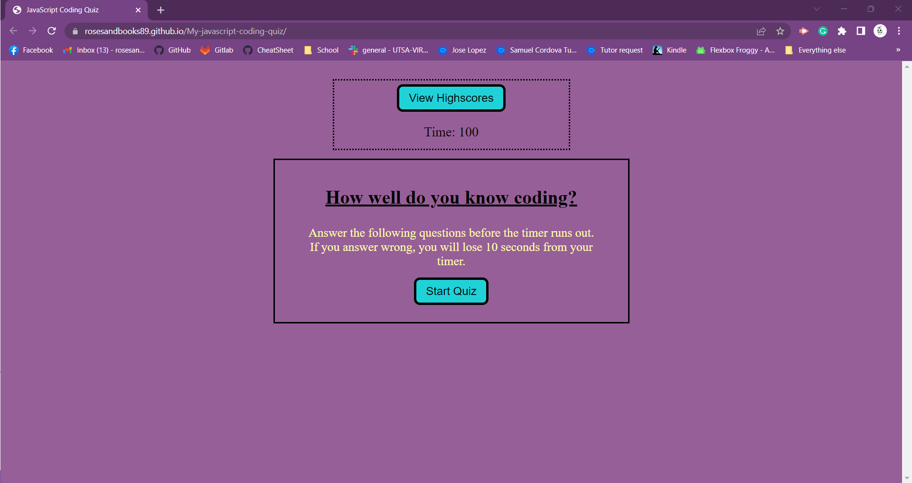
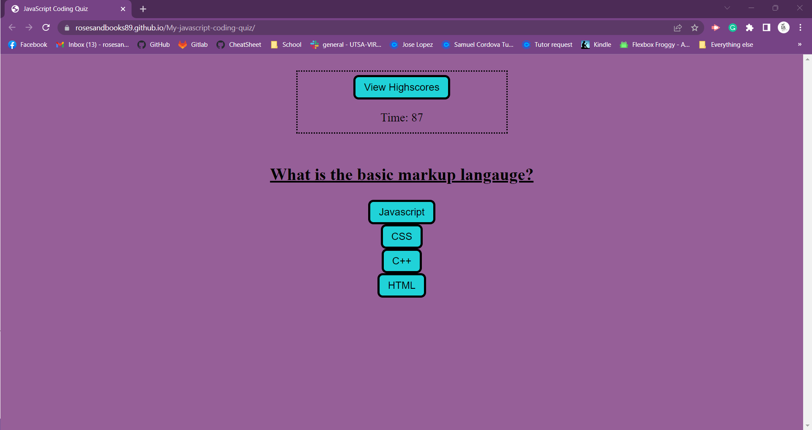
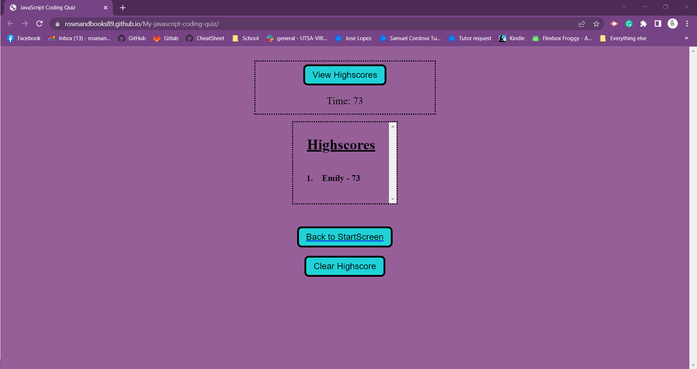

# Javascript Coding Quiz

## Description
To help you become familiar with these tests and give you a chance to apply the skills from this module, this week’s Challenge invites you to build a timed coding quiz with multiple-choice questions. This app will run in the browser, and will feature dynamically updated HTML and CSS powered by JavaScript code that you write. It will have a clean, polished, and responsive user interface. This week’s coursework will teach you all the skills you need to succeed in this assignment.
## Struggles
Javascript has proven to be the most difficult so far for me to retain the knowledge. So much i am forgetting my basics such as basic html and organizing my sections correctly.
But after working with my BCS Learning Assistants and my tutor to help get me back to where I need to be. 
I took the approach of outlineing aka pseudocoding (as i have learned that its called) my html and my javascript with the order the steps should take as the quiz moves forward. knowing this outline i was able to create my variables from the IDs of the outlines and  

## Links to my resources that helped me to better understand some fucntions. These were provided to me by BCS Assistants or ClassMates
* for my refresh button -
    * https://stackoverflow.com/questions/5611119/how-to-make-a-refresh-button-using-javascript 

* for local storage- 
    * https://www.w3schools.com/jsref/met_node_appendchild.asp
    * https://www.w3schools.com/jsref/met_document_createelement.asp
    * https://blog.bitsrc.io/how-to-use-localstorage-in-javascript-an-easy-guide-91aad566e4de
    * https://blog.logrocket.com/localstorage-javascript-complete-guide/

## Acceptance Criteria
* GIVEN I am taking a code quiz
* WHEN I click the start button
* THEN a timer starts and I am presented with a question
* WHEN I answer a question
* THEN I am presented with another question
* WHEN I answer a question incorrectly
* THEN time is subtracted from the clock
* WHEN all questions are answered or the timer reaches 0
* THEN the game is over
* WHEN the game is over
* THEN I can save my initials and my score

## Link to Deployed Application

Click [here](https://rosesandbooks89.github.io/My-javascript-coding-quiz/) to go  live Application

## Screenshots

